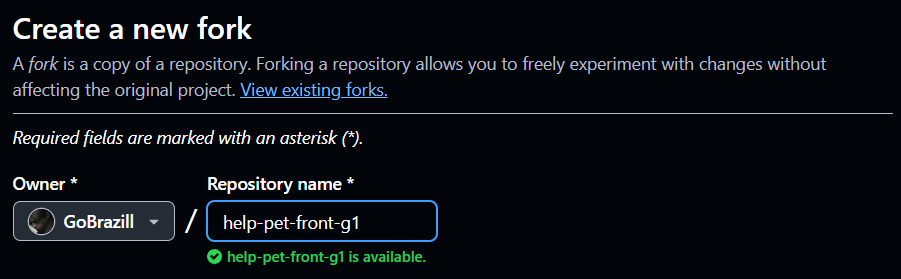

# Help Pet

## Sobre o projeto

## Objetivo

## Convenção de nomenclatura
> Padrão de nomeação que deve ser seguido em todas as etapas de desenvolvimento.

### Linguagem
- A ser decidido

### Arquivos e pastas
- kebab-case.
- Com exceção dos arquivos na pasta .github que devem ser todos em maiúsculo todas as pastas e arquivos devem permanecer neste padrão.
- Exemplo:

  ```
    ├── .github/
    │   ├── CODEOWNERS 
    │   └── PULL_REQUEST_TEMPLATE.md 
    └──── src/ 
           ├──assets
           └──pages
                └── page-one.html 
  ```

### Variáveis e funções
- camelCase.
- Nomes de variáveis e funções no front e back end devem seguir este padrão.
- Exemplos:

  ```java
  <!-- Java -->
  private String userName;

  public String getName() {
    return userName;
  }
  ```

  ```jsx
  <!-- JavaScript -->
    let accessIcon = document.getElementsByClassName("accessibility-icon")[0]
    let accessOpen = document.getElementsByClassName("accessibility-open")[0]

    function closeMenu() {
    accessOpen.style.display = "";
    accessIcon.style.display = "flex";
    }
  ```

### Componentes do react
- PascalCase.
- Tanto as pastas quanto o nome da função do componente devem seguir este padrão para serem diferenciados de funções normais.
- Exemplos:

  ```
  <!-- Estrutura das pastas -->
    └─── src/
        └── components
            └── Header <- Pasta com H maiúsculo
                ├── index.jsx
                └── style.css 
  ```

  ```jsx
  <!-- Dentro de index.jsx -->
    export default function Header() {

    }
  ```

### Endpoints
- kebab-case.
- Endpoints não devem iniciar nem finalizar com " / " e nomes compostos devem ser separados seguindo este padrão.
- Exemplo:

  ```java
    @RestController
    @RequestMapping("user")
    public class UserController {

        @PostMapping("login-admin")
	    public ResponseEntity<?> login(@RequestBody UserRequestDTO user) {
		
		    return ResponseEntity.ok(userService.login(user));
    	} 
    }
  ```

## Diagrama do banco de dados
> Importante que sejam seguidos os nomes nesse diagrama para garantir a consistência em todos os grupos. 

### TODO

## Tecnologias utilizadas


## Práticas Git
É aconselhado utilizar o padrão **Conventional Commits**. 
### Tipos e descrições principais

- `feat`- Commits do tipo feat indicam que seu trecho de código está incluindo um **novo recurso**.

- `fix` - Commits do tipo fix indicam que seu trecho de código commitado está **solucionando um problema** (bug fix).

- `docs` - Commits do tipo docs indicam que houveram **mudanças na documentação**, como por exemplo no Readme do seu repositório. (Não inclui alterações em código).

- `style` - Commits do tipo style indicam que houveram alterações referentes a **formatações de código**, indentação,  (Não inclui alterações em código).

- `refactor` - Commits do tipo refactor referem-se a mudanças devido a **refatorações que não alterem sua funcionalidade**, como por exemplo, uma alteração no formato como é processada determinada parte da tela, mas que manteve a mesma funcionalidade, ou melhorias de performance devido a um code review.

- `chore` - Commits do tipo chore indicam **atualizações de tarefas** de build, configurações de administrador, pacotes... como por exemplo adicionar um pacote no gitignore. (Não inclui alterações em código)

## Estruturas das branchs
A princípio serão duas branchs:
- **main** - Branch que contem código estável e pronto para merge ao repositório forkado.
- **qa/test** - Branch que contem onde ocorrerem testes para garantir o funcionamento correto antes de fazer merge na main.


Tendo essas duas branchs também haverá branchs para features, baseadas na main para merges na branch qa para testes. Exemplos:
- feat/header
- fix/user-login-endpoint
  
Sendo no front ou back end **Não se deve fazer alterações diretamente nas branchs main e qa**, para isso se deve criar outra branch com base no que será alterado como indicado acima.

## Como rodar o projeto

### Front-end
Clonando este repositório com o link: (url aqui) basta entrar na pasta utilizando  sua IDE de preferência basta iniciar o projeto no terminal com o comando `` npm start `` para rodar localmente.

### Back-end
Clonando este repositório com o link: (url aqui) basta entrar na pasta utilizando Intellij, para que a dependência `` lombok `` funcione corretamente, é necessário verificar se seu banco de dados está configurado corretamente em **application properties** e então rodar o arquivo `` HelpPetApplication.java ``.

## Como começar a contribuir
> O Tech Lead do seu grupo deve fazer forks nos repositórios front e back end e nomeá-los com o prefixo do seu grupo.
- Exemplo: 
 

## Licença
Este projeto é de uso acadêmico e não possui fins comerciais.